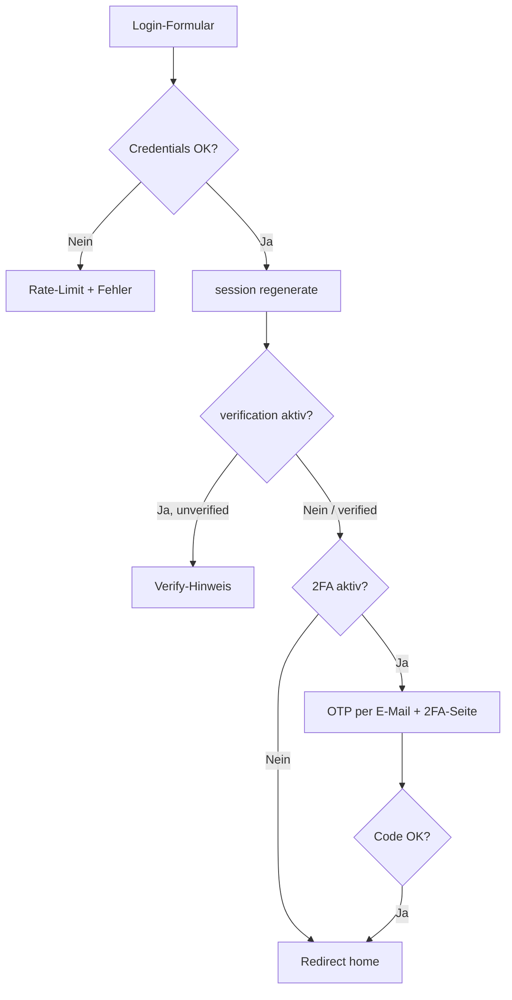

# Componist Auth

Livewire-basiertes Authentifizierungs-Package für Laravel-Anwendungen. Es liefert fertige UI-Komponenten für Login, Registrierung, Passwort-Reset, E-Mail-Verifizierung und E-Mail-basierte Zwei-Faktor-Authentifizierung (2FA) — inklusive Rate-Limiting, Session-Härtung und konfigurierbaren Feature-Flags.

---

## Schnellstart (Schritt für Schritt)

### 1. Package installieren

```bash
composer require componist/auth
```

Der `AuthServiceProvider` wird per Laravel Package Discovery automatisch geladen.

**Monorepo / lokales Path-Repository:**

```json
{
    "repositories": [
        { "type": "path", "url": "packages/componist/auth" }
    ],
    "require": {
        "componist/auth": "@dev"
    }
}
```

```bash
composer update componist/auth
```

### 2. Config publishen (empfohlen)

```bash
php artisan vendor:publish --tag=componist.auth.publish.config
```

Erzeugt `config/componist_auth.php`. Ohne Publish gilt die Default-Config aus dem Package.

### 3. Migrationen ausführen

Das Package lädt Migrationen automatisch. Sie erweitern `users` um `two_factor_code`, `two_factor_expires_at` und `last_login`.

```bash
php artisan migrate
```

### 4. User-Model anpassen

Trait und Contract einbinden; bei E-Mail-Verifizierung zusätzlich `MustVerifyEmail`:

```php
use Componist\Auth\Contracts\TwoFactorAuthenticatable;
use Componist\Auth\Traits\AddComponistAuthentication;
use Illuminate\Auth\MustVerifyEmail;

class User extends Authenticatable implements TwoFactorAuthenticatable
{
    use AddComponistAuthentication, MustVerifyEmail, /* … */;

    protected $hidden = ['password', 'remember_token', 'two_factor_code'];

    protected function casts(): array
    {
        return [
            'email_verified_at' => 'datetime',
            'two_factor_expires_at' => 'datetime',
            'password' => 'hashed',
        ];
    }
}
```

Details: [User-Model einrichten](#user-model-einrichten).

### 5. Config & `.env` anpassen

In `config/componist_auth.php` mindestens prüfen:

| Einstellung | Bedeutung |
|-------------|-----------|
| `home` | Named Route nach Login (z. B. `dashboard.index`) |
| `layouts-app` | **Pflicht** — Layout-View oder Blade-Component für Auth-Views ([`layouts-app`](#layout-layouts-app)) |
| `user_model` | Dein `App\Models\User` |

Optional in `.env`:

```env
COMPONIST_AUTH_VERIFICATION=false
COMPONIST_AUTH_TWO_FACTOR=false
COMPONIST_AUTH_REGISTER=true
COMPONIST_AUTH_RESET_PASSWORDS=true
```

### 6. `Authenticate`-Middleware in der App

Eigene Middleware anlegen und als `auth`-Alias registrieren, damit Verify- und 2FA-Checks auf allen geschützten Routen laufen:

- `app/Http/Middleware/Authenticate.php` — siehe [Integration](#integration-in-deine-laravel-anwendung)
- `bootstrap/app.php`: `'auth' => Authenticate::class`

`redirectGuestsTo()` ist **nicht** nötig — das Package setzt Gäste-Redirects auf `route('login')`.

### 7. Geschützte Routen definieren

```php
Route::middleware(['auth'])->group(function () {
    Route::view('dashboard', 'dashboard')->name('dashboard.index');
});
```

Auth-Routen (`/login`, `/register`, `/logout`, …) registriert das Package automatisch.

### 8. Views publishen (optional)

Nur nötig, wenn du die UI anpassen willst:

```bash
php artisan vendor:publish --tag=componist.auth.publish.views
```

Overrides liegen unter `resources/views/vendor/componistAuth/`.

### 9. Mailer konfigurieren

Für **2FA** und **E-Mail-Verifizierung** muss `MAIL_*` in `.env` korrekt sein und Mails zugestellt werden können.

### 10. Prüfen & loslegen

```bash
php artisan route:list --name=componist.auth.login
```

Im Browser: `/login` aufrufen, einloggen, Redirect auf `config('componist_auth.home')`.

**Logout in Blade:**

```blade
<a href="{{ route('componist.auth.logout') }}">Abmelden</a>
{{-- oder --}}
<x-componist-auth::logout-form />
```

Produktion: [Produktions-Checkliste](#produktions-checkliste).

---

## Inhaltsverzeichnis

- [Schnellstart (Schritt für Schritt)](#schnellstart-schritt-für-schritt)
- [Funktionen](#funktionen)
- [Anforderungen](#anforderungen)
- [Installation](#installation)
- [Konfiguration](#konfiguration)
- [Layout (`layouts-app`)](#layout-layouts-app)
- [User-Model einrichten](#user-model-einrichten)
- [Integration in deine Laravel-Anwendung](#integration-in-deine-laravel-anwendung)
- [Routen](#routen)
- [Middleware](#middleware)
- [Abläufe](#abläufe)
- [Views anpassen](#views-anpassen)
- [Sicherheit](#sicherheit)
- [Produktions-Checkliste](#produktions-checkliste)
- [Tests & Qualitätssicherung](#tests--qualitätssicherung)
- [Architektur](#architektur)
- [Lizenz](#lizenz)

---

## Funktionen

| Bereich | Beschreibung |
|--------|--------------|
| **Login** | E-Mail/Passwort, „Angemeldet bleiben“, Session-Regeneration nach erfolgreichem Login |
| **Registrierung** | Optional per Config/Env abschaltbar (Standard: in Production deaktiviert) |
| **Passwort vergessen** | Laravel `Password`-Broker, neutrale Antwort (keine User-Enumeration) |
| **Passwort zurücksetzen** | Token-basierter Reset via Livewire |
| **E-Mail-Verifizierung** | Optional; Laravel `MustVerifyEmail` + signierte Verify-Route |
| **2FA (E-Mail-OTP)** | 6-stelliger Code per E-Mail, SHA-256-Hash in der DB, 10 Min. Gültigkeit |
| **Logout** | `LogoutController` unter `/logout` (`GET`/`POST`); Session invalidieren + CSRF-Token erneuern; Blade-Komponente `logout-form` (GET-Link) |
| **Rate-Limiting** | Login, Register, Forgot Password, 2FA, Verify |
| **Feature-Flags** | Register, Reset, Verification, 2FA unabhängig schaltbar |
| **Views** | Publishbar; Vendor-Overrides unter `resources/views/vendor/componistAuth` |

---

## Anforderungen

- PHP 8.2+
- Laravel 11 oder 12
- [Livewire](https://livewire.laravel.com/) 4.x (`^4.0`, inkl. `Route::livewire()`)
- Eloquent `users`-Tabelle mit Standard-Laravel-Auth-Feldern
- Funktionierender Mailer (für 2FA und Verifizierung)

---

## Installation

Die vollständige Einrichtung in der empfohlenen Reihenfolge steht im [Schnellstart](#schnellstart-schritt-für-schritt). Kurzüberblick:

| Schritt | Befehl / Aktion |
|---------|-----------------|
| Installieren | `composer require componist/auth` |
| Config | `php artisan vendor:publish --tag=componist.auth.publish.config` |
| Migrationen | `php artisan migrate` (Spalten siehe Tabelle unten) |
| Views (optional) | `php artisan vendor:publish --tag=componist.auth.publish.views` |

**Publish-Tags:**

| Tag | Ziel |
|-----|------|
| `componist.auth.publish.config` | `config/componist_auth.php` |
| `componist.auth.publish.views` | `resources/views/vendor/componistAuth/…` |

Publizierte Views haben **Vorrang** vor den Package-Views (Namespace `componistAuth`).

### Migrationen (`users`-Erweiterung)

| Spalte | Typ | Zweck |
|--------|-----|--------|
| `two_factor_code` | `string(64)`, nullable | SHA-256-Hash des OTP |
| `two_factor_expires_at` | `timestamp`, nullable | Ablauf des Codes |
| `last_login` | `timestamp`, nullable | Letzter Login-Zeitpunkt |

Das Package enthält zwei Migrationen: die initiale Erweiterung der `users`-Tabelle und (falls bereits installiert) eine Anpassung des Spaltentyps `two_factor_code` für MySQL (`VARCHAR(64)`).

---

## Konfiguration

Alle Einstellungen unter dem Config-Key `componist_auth` (Datei `config/componist_auth.php`).

### Umgebungsvariablen

| Variable | Standard | Beschreibung |
|----------|----------|--------------|
| `COMPONIST_AUTH_VERIFICATION` | `false` | E-Mail-Verifizierung nach Login/Register |
| `COMPONIST_AUTH_TWO_FACTOR` | `false` | E-Mail-OTP nach Login |
| `COMPONIST_AUTH_REGISTER` | `true` außer Production | Öffentliche Registrierung |
| `COMPONIST_AUTH_RESET_PASSWORDS` | `true` | Passwort-vergessen-Flow |

### Config-Datei (Auszug)

```php
return [
    'verification' => (bool) env('COMPONIST_AUTH_VERIFICATION', false),
    'two-factor' => (bool) env('COMPONIST_AUTH_TWO_FACTOR', false),
    'home' => 'dashboard.index', // Named Route nach erfolgreichem Login
    'routes' => [
        'login' => 'componist.auth.login',
        'verification_notice' => 'componist.auth.verification.notice',
    ],
    'layouts-app' => \Componist\Core\View\Components\GuestLayout::class, // Pflicht — siehe Abschnitt unten
    'user_model' => \App\Models\User::class,
    'features' => [
        'register' => (bool) env('COMPONIST_AUTH_REGISTER', env('APP_ENV') !== 'production'),
        'resetPasswords' => (bool) env('COMPONIST_AUTH_RESET_PASSWORDS', true),
    ],
    'login' => [
        'example' => [
            'email' => null,   // Nur außerhalb production – niemals echte Credentials setzen
            'password' => null,
        ],
    ],
];
```

### Wichtige Config-Keys

| Key | Beschreibung |
|-----|--------------|
| `home` | Named Route für Redirects nach Login, Verify, 2FA |
| `routes.login` | Primärer Routenname für Login und Gäste-Redirects (`ComponistAuthConfig::loginRoute()`) |
| `routes.verification_notice` | Routenname für Verify-Hinweis (`ComponistAuthConfig::verificationNoticeRoute()`) |
| `layouts-app` | **Pflicht** — siehe [Layout (`layouts-app`)](#layout-layouts-app) |
| `user_model` | Muss `Model`, `Authenticatable` und `TwoFactorAuthenticatable` erfüllen |
| `features.register` | Bei `false`: Register-Route liefert 404 |
| `features.resetPasswords` | Bei `false`: Forgot-Password-Route liefert 404 |

### Layout (`layouts-app`)

Der Config-Key `layouts-app` ist **verpflichtend**. Alle Auth-Livewire-Seiten (Login, Register, Passwort-Reset, Verify, 2FA) rendern ihre Inhalte über das Trait `RendersAuthView`: Die View wird per `view()->extends(…)` in dein Layout **eingebettet** (Section `content`). Der Wert ist ein **nicht-leerer String** — typischerweise ein **View-Name** (z. B. `layouts.guest`) oder die FQCN einer Blade-Component, deren View `@yield('content')` bereitstellt. Fehlt das Layout oder die Section `content`, schlagen Auth-Seiten mit einem View-Fehler fehl.

#### Standard (Componist Core)

Die Package-Default-Config verweist auf:

```php
'layouts-app' => \Componist\Core\View\Components\GuestLayout::class,
```

Dafür muss das Paket **`componist/core`** (bzw. die Klasse `GuestLayout`) in der Host-App verfügbar sein — z. B. per `composer require` oder Path-Repository im Monorepo. Ohne dieses Paket **musst** du ein eigenes Layout eintragen (View-Name oder eigene Component).

#### Eigenes Layout anlegen

Wenn `GuestLayout` nicht existiert oder du ein anderes Design willst:

**Variante A — Blade-View (empfohlen, einfachste Integration):**

1. Layout-View mit Section `content` anlegen, z. B. `resources/views/layouts/guest.blade.php`:

```blade
{{-- resources/views/layouts/guest.blade.php --}}
<!DOCTYPE html>
<html lang="{{ str_replace('_', '-', app()->getLocale()) }}">
<head>
    <meta charset="utf-8">
    <meta name="viewport" content="width=device-width, initial-scale=1">
    <title>{{ $title ?? config('app.name') }}</title>
    @vite(['resources/css/app.css', 'resources/js/app.js'])
    @livewireStyles
</head>
<body class="antialiased">
    @yield('content')

    @livewireScripts
</body>
</html>
```

2. In der Config: `'layouts-app' => 'layouts.guest'`

**Variante B — Blade-Component:**

```bash
php artisan make:component GuestLayout
```

3. **Layout-View** der Component mit Section `content`:

```blade
{{-- resources/views/components/guest-layout.blade.php --}}
<!DOCTYPE html>
<html lang="{{ str_replace('_', '-', app()->getLocale()) }}">
<head>
    <meta charset="utf-8">
    <meta name="viewport" content="width=device-width, initial-scale=1">
    <title>{{ $title ?? config('app.name') }}</title>
    @vite(['resources/css/app.css', 'resources/js/app.js'])
    @livewireStyles
</head>
<body class="antialiased">
    @yield('content')

    @livewireScripts
</body>
</html>
```

4. **Config** nach dem Publishen anpassen (Variante B):

```php
use App\View\Components\GuestLayout;

'layouts-app' => GuestLayout::class,
```

Das Layout **muss** `@yield('content')` bereitstellen. Layouts nur mit `$slot` (ohne `@yield`) funktionieren mit `RendersAuthView` nicht.

#### Checkliste

- [ ] `config/componist_auth.php` publiziert und `layouts-app` gesetzt
- [ ] Der eingetragene View-Name bzw. die Component existiert und ist auflösbar
- [ ] Layout-View enthält `@yield('content')`
- [ ] Im Browser `/login` lädt ohne View-/Component-Fehler

---

## User-Model einrichten

Das User-Model muss das Contract `TwoFactorAuthenticatable` implementieren und den Trait `AddComponistAuthentication` verwenden. Für E-Mail-Verifizierung wird `MustVerifyEmail` benötigt.

```php
<?php

namespace App\Models;

use Componist\Auth\Contracts\TwoFactorAuthenticatable;
use Componist\Auth\Traits\AddComponistAuthentication;
use Illuminate\Auth\MustVerifyEmail;
use Illuminate\Database\Eloquent\Factories\HasFactory;
use Illuminate\Foundation\Auth\User as Authenticatable;
use Illuminate\Notifications\Notifiable;

class User extends Authenticatable implements TwoFactorAuthenticatable
{
    use AddComponistAuthentication, HasFactory, MustVerifyEmail, Notifiable;

    protected $fillable = [
        'name',
        'email',
        'password',
    ];

    protected $hidden = [
        'password',
        'remember_token',
        'two_factor_code', // Hash niemals serialisieren
    ];

    protected function casts(): array
    {
        return [
            'email_verified_at' => 'datetime',
            'two_factor_expires_at' => 'datetime',
            'password' => 'hashed',
        ];
    }
}
```

### Trait `AddComponistAuthentication`

| Methode | Beschreibung |
|---------|--------------|
| `generateTwoFactorCode()` | Erzeugt 6-stelligen Code (`random_int`), speichert Hash, sendet `TwoFactorCode`-Notification |
| `resetTwoFactorCode()` | Löscht Code und Ablaufzeit |
| `hashTwoFactorCode(string $code)` | SHA-256 für Speicherung/Vergleich |
| `verifyTwoFactorCode(Model $user, string $code)` | Timing-sicherer Vergleich via `hash_equals` |

---

## Integration in deine Laravel-Anwendung

Das Package registriert Auth-Routen und Middleware-Aliase (`verify`, `twofactor`). Damit **alle** geschützten Routen deiner Anwendung automatisch Verifizierung und 2FA durchlaufen, solltest du das Laravel-`auth`-Middleware-Alias in deiner App überschreiben.

### 1. Eigene `Authenticate`-Middleware

Datei: `app/Http/Middleware/Authenticate.php`

```php
<?php

namespace App\Http\Middleware;

use Closure;
use Componist\Auth\Middleware\TwoFactorMiddleware;
use Componist\Auth\Middleware\VerifyEmailMiddleware;
use Illuminate\Auth\Middleware\Authenticate as Middleware;
use Illuminate\Http\Request;
use Symfony\Component\HttpFoundation\Response;

class Authenticate extends Middleware
{
    public function handle($request, Closure $next, ...$guards): Response
    {
        $this->authenticate($request, $guards);

        if ($this->shouldSkipComponistAuthChecks($request)) {
            return $next($request);
        }

        $verifyResponse = app(VerifyEmailMiddleware::class)->handle(
            $request,
            fn (): Response => new Response('', Response::HTTP_OK),
        );

        if ($verifyResponse->isRedirect()) {
            return $verifyResponse;
        }

        return app(TwoFactorMiddleware::class)->handle($request, $next);
    }

    protected function shouldSkipComponistAuthChecks(Request $request): bool
    {
        return in_array($request->route()?->getName(), [
            'componist.auth.logout',
            'componist.auth.verification.notice',
            'componist.auth.verification.verify',
            'componist.auth.twoFactorAuth',
        ], true);
    }
}
```

Diese Ausnahmen erlauben Logout, Verify- und 2FA-Seiten auch dann, wenn 2FA noch aussteht oder die E-Mail noch nicht verifiziert ist.

### 2. `bootstrap/app.php`

```php
use App\Http\Middleware\Authenticate;

->withMiddleware(function (Middleware $middleware): void {
    $middleware->alias([
        'auth' => Authenticate::class,
    ]);
})
```

Der `AuthServiceProvider` übernimmt zusätzlich (ohne Eintrag in `bootstrap/app.php`):

- **Login-Route** `componist.auth.login` (Pfad `/login`, Middleware `guest`)
- **Standard-Alias** `login` → gleiche URL (über `URL::resolveMissingNamedRoutesUsing()`)
- **Gäste-Redirect** `Authenticate::redirectUsing()` → `route(ComponistAuthConfig::loginRoute())`

Eine `redirectGuestsTo()`-Zeile in `bootstrap/app.php` ist **nicht** nötig. Beide Aufrufe funktionieren in Blade und PHP:

```blade
<a href="{{ route('login') }}">Anmelden</a>
<a href="{{ route('componist.auth.login') }}">Anmelden</a>
```

**Eigener Login (SSO, externe URL):** Wenn die Host-App ein anderes Redirect-Ziel braucht, `redirectGuestsTo()` in `bootstrap/app.php` setzen und prüfen, dass der Provider-Boot nicht ungewollt überschreibt — oder `componist_auth.routes.login` auf eine eigene Named Route zeigen lassen.

### 3. Geschützte Routen

Alle internen Routen weiterhin mit `middleware(['auth'])` — die erweiterte Middleware übernimmt den Rest:

```php
Route::middleware(['auth'])->group(function () {
    Route::view('dashboard', 'dashboard')->name('dashboard.index');
});
```

Optional können `verify` und `twofactor` auch **einzeln** auf Routen gesetzt werden (Aliase aus dem `AuthServiceProvider`). In der Regel ist die zentrale `Authenticate`-Middleware ausreichend.

### 4. HTTPS & Session (Production)

In `AppServiceProvider`:

```php
if ($this->app->environment('production')) {
    URL::forceScheme('https');
}
```

In `.env` / `config/session.php`:

```env
SESSION_SECURE_COOKIE=true
SESSION_HTTP_ONLY=true
SESSION_SAME_SITE=lax
```

---

## Routen

Alle Auth-Routen laufen in der `web`-Middleware-Gruppe (vom `AuthServiceProvider` geladen). **Primär** tragen alle Namen das Präfix `componist.auth.`.

| Methode | Pfad | Route-Name | Middleware | Beschreibung |
|---------|------|------------|------------|--------------|
| GET | `/login` | `componist.auth.login` | `guest` | Login-Formular (Livewire) |
| GET | `/forgot-password` | `componist.auth.password.request` | `guest` | Passwort vergessen |
| GET | `/reset-password/{token}` | `componist.auth.password.reset` | `guest` | Neues Passwort setzen — URL in Reset-E-Mails |
| GET | `/register` | `componist.auth.register` | `guest` | Registrierung (404 wenn deaktiviert) |
| GET/POST | `/logout` | `componist.auth.logout` | `auth` | Abmelden (Session invalidieren, Redirect Login) |
| GET | `/email/verify` | `componist.auth.verification.notice` | `auth` | Hinweis „E-Mail bestätigen“ |
| GET | `/email/verify/{id}/{hash}` | `componist.auth.verification.verify` | `auth`, `signed`, `throttle:6,1` | Link aus Verifizierungs-E-Mail |
| GET | `/two-factor-auth` | `componist.auth.twoFactorAuth` | `auth` | 2FA-Code eingeben |

### Logout in Blade

Die Route `/logout` akzeptiert **GET und POST** (`LogoutController`). Für Menü-Links reicht GET:

```blade
<a href="{{ route('componist.auth.logout') }}">Abmelden</a>
```

Oder die Package-Komponente (styled GET-Link, optional Slot für Label):

```blade
<x-componist-auth::logout-form />
```

Für POST (z. B. mit CSRF in einem Formular): `route('componist.auth.logout')` mit `@csrf` und `method="POST"`.

### Laravel-Standard-Routennamen & Aliase

| Pfad | Primärer Name (Package) | Standard-Alias |
|------|-------------------------|----------------|
| `/login` | `componist.auth.login` | `login` |
| `/forgot-password` | `componist.auth.password.request` | `password.request` |
| `/reset-password/{token}` | `componist.auth.password.reset` | `password.reset` |
| `/email/verify` | `componist.auth.verification.notice` | `verification.notice` |
| `/email/verify/{id}/{hash}` | `componist.auth.verification.verify` | `verification.verify` |

Laravel-Notifications und Host-Code können weiterhin `route('login')`, `route('password.reset')` usw. nutzen — Aliase werden über `ComponistAuthRouteAliases` und `URL::resolveMissingNamedRoutesUsing()` aufgelöst. Passwort- und Verifizierungs-URLs in E-Mails werden zusätzlich über `ResetPassword::createUrlUsing()` bzw. `VerifyEmail::createUrlUsing()` auf Package-Routen gesetzt.

Intern nutzt das Package `ComponistAuthConfig::loginRoute()` (Standard: `componist.auth.login`) für Redirects nach Logout, Verify und in der `Authenticate`-Middleware.

```bash
php artisan route:list --name=componist.auth.login
```

---

## Middleware

| Alias | Klasse | Verhalten |
|-------|--------|-----------|
| `verify` | `VerifyEmailMiddleware` | Redirect zu `ComponistAuthConfig::verificationNoticeRoute()` (Standard: `componist.auth.verification.notice`), wenn `verification` aktiv und `email_verified_at` leer |
| `twofactor` | `TwoFactorMiddleware` | Redirect zu `componist.auth.twoFactorAuth`, wenn `two-factor` aktiv und ein ausstehender Pending-Code (`two_factor_code` gesetzt) existiert — auch nach Ablauf der 10 Minuten |

Beide Middleware sind **no-op**, wenn das jeweilige Feature in der Config deaktiviert ist.

---

## Abläufe

### Login



1. Validierung + Rate-Limit (5 Versuche / E-Mail+IP)
2. `Auth::attempt()` → bei Erfolg `session()->regenerate()`
3. Optional: Verifizierungs-Mail senden → Redirect Notice
4. Optional: `generateTwoFactorCode()` → Redirect 2FA
5. Sonst: Redirect zu `config('componist_auth.home')`

### Registrierung

1. Nur wenn `features.register === true`
2. User anlegen, `Registered`-Event, automatischer Login
3. Wie Login: optional Verify, dann optional 2FA

### Passwort vergessen

- Immer dieselbe Erfolgsmeldung (`ForgotPassword::RESET_LINK_SENT_MESSAGE`), unabhängig davon, ob die E-Mail existiert
- Kein `addError` bei unbekannter Adresse (Schutz vor Enumeration)
- Rate-Limit: 5 Versuche pro E-Mail+IP

### 2FA

- Code: 6 Ziffern, per `random_int` erzeugt
- Speicherung: nur SHA-256-Hash (64 Zeichen)
- Gültigkeit: 10 Minuten (`two_factor_expires_at`)
- Vergleich: `hash_equals` über `AddComponistAuthentication::verifyTwoFactorCode()`
- Nach Erfolg: `resetTwoFactorCode()`, Redirect `home`
- Rate-Limit: 5 Fehlversuche pro User (OTP), 3 Anfragen für „Neuen Code anfordern“
- **Pending-Sperre:** Solange `two_factor_code` in der DB steht, blockiert `TwoFactorMiddleware` alle geschützten Routen (Redirect zur 2FA-Seite) — unabhängig davon, ob der Code abgelaufen ist. Abgelaufene Codes können nur auf der 2FA-Seite per „Neuen Code anfordern“ erneuert werden; ein Zugriff auf das Dashboard ohne gültigen OTP ist nicht möglich.

**Hinweis:** Es handelt sich um **E-Mail-OTP**, nicht um TOTP (Google Authenticator). Für höchste Sicherheitsanforderungen ist TOTP ein separates Erweiterungsthema.

---

## Views anpassen

### Publish

```bash
php artisan vendor:publish --tag=componist.auth.publish.views
```

### View-Dateien (Package)

```
resources/views/livewire/auth/
├── login.blade.php
├── register.blade.php
├── forgot-password.blade.php
├── reset-password.blade.php
├── two-factor-auth-controller.blade.php
└── verify-email.blade.php

resources/views/emails/
└── 2fa-code.blade.php

resources/css/
├── auth.css          # optionaler Standalone-Tailwind-Einstieg
└── auth-theme.css    # Design-System (Klassen, Tokens, Animationen)

resources/views/components/
├── auth-page.blade.php           # Shell → Card → Heading → Content → Footer
├── auth-form.blade.php           # Formular-Wrapper
├── auth-actions.blade.php        # Button-Gruppe
├── auth-footer.blade.php         # Footer-Links
├── auth-input / auth-password    # Felder inkl. Fehler (field="…")
├── auth-otp.blade.php            # 6-stelliger Code
├── auth-button / auth-button-secondary
├── auth-alert / auth-callout     # success | error | info
├── auth-field-error.blade.php
├── auth-centered / auth-icon-badge
├── auth-brand.blade.php            # Logo aus Config
└── logout-form.blade.php
```

### Layout

- **Eine Spalte**, zentrierter Content (`max-width: 28rem`), responsive Padding (`100dvh`).
- Dunkler Slate-Hintergrund mit dezenten Teal-Verläufen.
- Kompakte Brand-Zeile (Logo + App-Name) über der Karte.

### Logo (Config)

Logo und Branding werden zentral über `config/componist_auth.php` → `logo` gesteuert (Komponente `auth-brand` in allen Auth-Views via `auth-shell`).

```env
COMPONIST_AUTH_LOGO_PATH=images/logo.svg
COMPONIST_AUTH_LOGO_ALT="Meine App"
COMPONIST_AUTH_LOGO_HREF=/
COMPONIST_AUTH_LOGO_HEIGHT=2.75rem
COMPONIST_AUTH_LOGO_SHOW_BRAND_NAME=true
COMPONIST_AUTH_LOGO_BRAND_NAME=
```

| Key | Beschreibung |
|-----|----------------|
| `path` | Pfad unter `public/` (z. B. `images/logo.svg`) oder absolute URL (`https://…`) |
| `alt` | Alt-Text für `` (Standard: `APP_NAME`) |
| `href` | Optionaler Klick-Link: URL, Pfad (`/`) oder Named Route (`componist.auth.login`) |
| `height` | CSS-Höhe des Logos (Standard: `2.5rem`) |
| `show_brand_name` | App-Namen unter/neben Logo anzeigen |
| `brand_name` | Anzeigename überschreiben (sonst `APP_NAME`) |

Ohne `path` wird das Standard-SVG-Icon angezeigt.

### SEO

`auth-page` schreibt per `@push('meta')` ins Guest-Layout:

- `<title>`, `description`, `robots`, `canonical`
- Open Graph + Twitter Card

Pro Seite `meta-description` setzen. Standard-`robots`: `noindex, nofollow` (Config: `componist_auth.seo.robots` / `COMPONIST_AUTH_SEO_ROBOTS`).

### Einheitliche Seitenstruktur

Jede Auth-View folgt demselben Schema:

```blade
<x-componist-auth::auth-page
    title="…"
    subtitle="…"
    meta-description="…"
>
    <x-componist-auth::auth-form wire:submit="…">
        <x-componist-auth::auth-input … field="email" />
        <x-componist-auth::auth-actions>
            <x-componist-auth::auth-button>…</x-componist-auth::auth-button>
        </x-componist-auth::auth-actions>
    </x-componist-auth::auth-form>

    <x-slot:footer>
        <x-componist-auth::auth-link :href="route('…')">…</x-componist-auth::auth-link>
    </x-slot:footer>
</x-componist-auth::auth-page>
```

### Layout

Alle Auth-Views nutzen `ComponistAuthConfig::layoutComponent()` (Config-Key `layouts-app`, Standard: `GuestLayout::class`). Das Layout muss eine `content`-Section (`@yield('content')`) unterstützen.

### CSS & Frontend (wichtig)

Die Auth-UI nutzt **Tailwind-Klassen** aus den Package-Views. Damit Styles greifen, muss die Host-App:

1. **`guest.css`** (oder `app.css`) um die Package-Views erweitern (Tailwind v4 `@source`):

```css
@source '../../packages/componist/auth/resources/views/**/*.blade.php';
/* nach Composer-Install: */
@source '../../vendor/componist/auth/resources/views/**/*.blade.php';

@import '../../packages/componist/auth/resources/css/auth-theme.css';
```

2. **`GuestLayout`** muss **`guest.css` + `guest.js`** laden (Alpine für Passwort-Toggle), nicht `app.css` — und `@livewireStyles` / `@livewireScripts` enthalten.

3. Nach Änderungen: `npm run build` oder `npm run dev`.

Optional: `php artisan vendor:publish --tag=componist.auth.publish.assets` und `auth.css` als weiteren Vite-Eintrag, wenn du kein gemeinsames `guest.css` verwendest.

### Livewire-Komponenten (intern registriert)

| Alias | Klasse |
|-------|--------|
| `auth.login` | `UserLoginController` |
| `auth.register` | `UserRegisterController` |
| `auth.verify-email` | `VerifyEmail` |
| `auth.two-factor-auth-controller` | `TwoFactorAuthController` |
| `auth.forgot-password` | `ForgotPassword` |
| `auth.reset-password` | `ResetPassword` |

### UI-Hinweis (Loading-States)

Die Views verwenden Livewire `wire:loading` / `wire:target` für Submit-Buttons — **kein** Alpine-`x-show`, das Buttons nach Fehlversuchen dauerhaft ausblendet.

---

## Sicherheit

| Maßnahme | Umsetzung |
|----------|-----------|
| Session-Fixation | `session()->regenerate()` direkt nach `Auth::attempt()` / Register-Login |
| Logout | `GET`/`POST` `/logout`; `session()->invalidate()` + `regenerateToken()` |
| 2FA-Speicherung | Nur Hash (SHA-256), kein Klartext in der DB |
| 2FA-Vergleich | `hash_equals` |
| 2FA-Zufall | `random_int`, nicht `rand()` |
| 2FA-Pending-Sperre | Geschützte Routen gesperrt, bis OTP bestätigt (`two_factor_code` geleert) — auch bei abgelaufenem Code |
| Rate-Limiting | Login, Register, Forgot, 2FA, Verify-Throttle |
| User-Enumeration (Reset) | Einheitliche Erfolgsmeldung |
| Demo-Login | Beispiel-Credentials nur außerhalb `production` in `UserLoginController::mount()` |
| CSRF | Standard Laravel `web`-Stack |
| Feature-Flags | Deaktivierte Features → `abort(404)` auf den jeweiligen Livewire-Seiten |

### Login-Redirect & Routen-Alias (Package-Integration)

| Thema | Verhalten | Sicherheit |
|-------|-----------|------------|
| `Authenticate::redirectUsing()` | Setzt global das Redirect-Ziel für nicht authentifizierte Nutzer auf `route(ComponistAuthConfig::loginRoute())` | Kein Open Redirect — nur Named Routes der App |
| `URL::resolveMissingNamedRoutesUsing()` | Mappt Laravel-Standardnamen (`login`, `password.reset`, …) auf `componist.auth.*` | Kein beliebiges Auflösen fremder Routennamen; Parameter werden an die Zielroute durchgereicht |
| Login-Route | Weiterhin `guest`-Middleware | Kein Zugriff für eingeloggte Nutzer auf die Login-Seite (Redirect zu `home`) |

**Hinweise für Host-Apps:**

- Wenn die Anwendung **bereits** einen `resolveMissingNamedRoutesUsing`-Callback nutzt, kann der Package-Callback ihn **ersetzen** (Laravel erlaubt nur einen Resolver). In dem Fall Alias-Logik in der App nachbilden oder nur `route('login')` verwenden.
- `componist_auth.routes.login` nur auf vertrauenswürdige Named Routes setzen (wie jede Auth-Config).
- Der frühere Production-Fehler `Route [login] not defined` entstand, wenn Laravel standardmäßig nach `login` suchte, ohne registrierte Route — behoben durch Alias-Resolver (`login` → `componist.auth.login`) und `componist_auth.routes.login`.

### Bewusst nicht enthalten (Roadmap)

- TOTP / Authenticator-Apps
- CAPTCHA / Bot-Schutz
- `Password::uncompromised()` (Have I Been Pwned)
- Zentrales Failed-Login-Logging
- CSP / HSTS-Header (Verantwortung der einbindenden Anwendung)

---

## Produktions-Checkliste

- [ ] `COMPONIST_AUTH_REGISTER=false`
- [ ] `COMPONIST_AUTH_VERIFICATION` / `COMPONIST_AUTH_TWO_FACTOR` bewusst setzen
- [ ] Keine Demo-Credentials in `componist_auth.login.example`
- [ ] `layouts-app` zeigt auf ein auflösbares Layout mit `@yield('content')` ([Details](#layout-layouts-app))
- [ ] `App\Http\Middleware\Authenticate` registriert (`auth`-Alias in `bootstrap/app.php`)
- [ ] **Kein** manuelles `redirectGuestsTo()` nötig — Package setzt Redirect auf `componist.auth.login` (prüfen nach Deploy: geschützte URL → Redirect `/login`, kein 500)
- [ ] Nach Deploy: `php artisan route:clear` und `php artisan config:clear` (bei Route-/Config-Cache)
- [ ] `php artisan route:list --name=componist.auth.login` zeigt Route `componist.auth.login` → `/login`
- [ ] `URL::forceScheme('https')` in Production
- [ ] `SESSION_SECURE_COOKIE=true`, `SESSION_SAME_SITE=lax`
- [ ] Mailer konfiguriert und getestet (2FA + Verify)
- [ ] Alle geschützten Routen nutzen `middleware(['auth'])`
- [ ] Logout-Links zeigen auf `route('componist.auth.logout')` (GET reicht)
- [ ] Blade-Links zum Login: `route('login')` oder `route('componist.auth.login')` (beides gleichwertig)

---

## Tests & Qualitätssicherung

### Tests ausführen

Die Tests laufen **in der Host-Laravel-App**, in die das Package eingebunden ist (Path-Repository oder `vendor/`). Das Package hat keine eigene `phpunit.xml` — `tests/TestCase.php` erweitert die App-Basis.

Aus dem Stammverzeichnis der Anwendung:

```bash
php artisan test --compact vendor/componist/auth/tests
```

In einem Monorepo mit Path-Repository:

```bash
php artisan test --compact packages/componist/auth/tests
```

Die Suite umfasst Unit-Tests (Trait, Config, Route-Aliase) sowie Feature-Tests (Livewire, Routen, Middleware inkl. erweiterter `Authenticate`-Middleware der Host-App).

### PHPStan (Level max)

Im Stammverzeichnis des Packages:

```bash
composer phpstan
```

Entspricht `vendor/bin/phpstan analyse -c phpstan.neon.dist` (Larastan, Level max).

---

## Architektur

```
├── config/auth.php              # Default-Config (merge als componist_auth)
├── database/migrations/         # users-Erweiterungen (+ Spaltentyp-Fix)
├── routes/web.php               # Auth-Routen (Route::livewire)
├── resources/views/             # Blade, E-Mail, logout-form
├── src/
│   ├── AuthServiceProvider.php
│   ├── Contracts/
│   │   └── TwoFactorAuthenticatable.php
│   ├── Http/Controllers/
│   │   └── LogoutController.php
│   ├── Livewire/
│   │   ├── Auth/                # Livewire-Controller
│   │   └── Concerns/
│   │       └── RendersAuthView.php
│   ├── Middleware/
│   │   ├── TwoFactorMiddleware.php
│   │   └── VerifyEmailMiddleware.php
│   ├── Notifications/
│   │   └── TwoFactorCode.php
│   ├── Support/
│   │   ├── AuthView.php              # Enum der View-Namen
│   │   ├── AuthenticatedUser.php
│   │   ├── ComponistAuthConfig.php
│   │   └── ComponistAuthRouteAliases.php
│   └── Traits/
│       └── AddComponistAuthentication.php
└── tests/
```

### `ComponistAuthConfig`

Zentraler Zugriff auf typisierte Config-Werte:

| Methode | Beschreibung |
|---------|--------------|
| `homeRoute()` | Named Route nach Login / Verify / 2FA |
| `loginRoute()` | Named Route für Login und Gäste-Redirects (Config: `routes.login`) |
| `verificationNoticeRoute()` | Named Route für Verify-Hinweis (Config: `routes.verification_notice`) |
| `layoutComponent()` | Layout für `RendersAuthView` (Config: `layouts-app`) |
| `userModel()` | Konfiguriertes User-Model (mit Contract-Prüfung) |
| `verificationEnabled()` | Feature-Flag E-Mail-Verifizierung |
| `twoFactorEnabled()` | Feature-Flag E-Mail-OTP |
| `registerEnabled()` | Feature-Flag Registrierung |

### `AuthServiceProvider` (Boot)

| Registrierung | Zweck |
|---------------|--------|
| `Authenticate::redirectUsing()` | Gäste-Redirect auf `route(loginRoute())` |
| `URL::resolveMissingNamedRoutesUsing()` | Standard-Aliase via `ComponistAuthRouteAliases` |
| Livewire-Komponenten, Middleware-Aliase `verify` / `twofactor` | UI und optionale Einzel-Middleware |

### `AuthenticatedUser`

Hilfsklasse nach Login für typisierten Zugriff auf den eingeloggten User inkl. 2FA-Methoden.

---

## Lizenz

MIT — siehe [LICENSE](LICENSE).

---

## Support & Weiterentwicklung

- **Autor:** Componist Developer — info@componist.dev
- **Package-Name (Composer):** `componist/auth`
- Bei Bugs oder Feature-Wünschen: Issue im Repository des Packages
