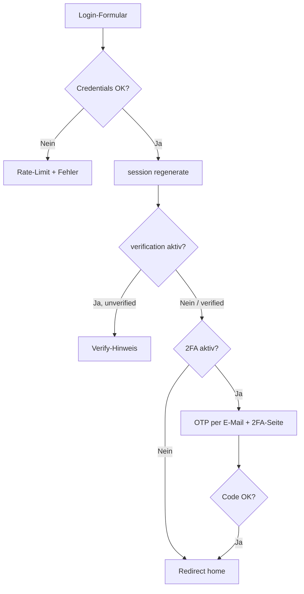

# Componist Auth

Livewire-basiertes Authentifizierungs-Package für Laravel-Anwendungen. Es liefert fertige UI-Komponenten für Login, Registrierung, Passwort-Reset, E-Mail-Verifizierung und E-Mail-basierte Zwei-Faktor-Authentifizierung (2FA) — inklusive Rate-Limiting, Session-Härtung und konfigurierbaren Feature-Flags.

---

## Inhaltsverzeichnis

- [Funktionen](#funktionen)
- [Anforderungen](#anforderungen)
- [Installation](#installation)
- [Konfiguration](#konfiguration)
- [User-Model einrichten](#user-model-einrichten)
- [Integration in deine Laravel-Anwendung](#integration-in-deine-laravel-anwendung)
- [Routen](#routen)
- [Middleware](#middleware)
- [Abläufe](#abläufe)
- [Views anpassen](#views-anpassen)
- [Sicherheit](#sicherheit)
- [Produktions-Checkliste](#produktions-checkliste)
- [Tests & Qualitätssicherung](#tests--qualitätssicherung)
- [Architektur](#architektur)
- [Lizenz](#lizenz)

---

## Funktionen

| Bereich | Beschreibung |
|--------|--------------|
| **Login** | E-Mail/Passwort, „Angemeldet bleiben“, Session-Regeneration nach erfolgreichem Login |
| **Registrierung** | Optional per Config/Env abschaltbar (Standard: in Production deaktiviert) |
| **Passwort vergessen** | Laravel `Password`-Broker, neutrale Antwort (keine User-Enumeration) |
| **Passwort zurücksetzen** | Token-basierter Reset via Livewire |
| **E-Mail-Verifizierung** | Optional; Laravel `MustVerifyEmail` + signierte Verify-Route |
| **2FA (E-Mail-OTP)** | 6-stelliger Code per E-Mail, SHA-256-Hash in der DB, 10 Min. Gültigkeit |
| **Logout** | Per `GET` oder `POST` unter `/logout`, Session invalidieren + CSRF-Token erneuern |
| **Rate-Limiting** | Login, Register, Forgot Password, 2FA, Verify |
| **Feature-Flags** | Register, Reset, Verification, 2FA unabhängig schaltbar |
| **Views** | Publishbar; Vendor-Overrides unter `resources/views/vendor/componistAuth` |

---

## Anforderungen

- PHP 8.2+
- Laravel 11 oder 12
- [Livewire](https://livewire.laravel.com/) 3.x oder 4.x
- Eloquent `users`-Tabelle mit Standard-Laravel-Auth-Feldern
- Funktionierender Mailer (für 2FA und Verifizierung)

---

## Installation

### Composer

```bash
composer require componist/auth
```

Der `AuthServiceProvider` wird über Laravel Package Discovery automatisch registriert (`extra.laravel.providers` in der Package-`composer.json`).

### Lokale Entwicklung (Path-Repository)

Wenn du das Package aus einem lokalen Verzeichnis einbindest:

```json
{
    "repositories": [
        {
            "type": "path",
            "url": "../componist-auth"
        }
    ],
    "require": {
        "componist/auth": "@dev"
    }
}
```

```bash
composer update componist/auth
```

### Datenbank-Migrationen

Das Package lädt Migrationen automatisch. Sie erweitern die `users`-Tabelle um:

| Spalte | Typ | Zweck |
|--------|-----|--------|
| `two_factor_code` | `string(64)`, nullable | SHA-256-Hash des OTP |
| `two_factor_expires_at` | `timestamp`, nullable | Ablauf des Codes |
| `last_login` | `timestamp`, nullable | Letzter Login-Zeitpunkt |

```bash
php artisan migrate
```

### Config & Views publishen

```bash
php artisan vendor:publish --tag=componist.auth.publish.config
php artisan vendor:publish --tag=componist.auth.publish.views
```

Danach liegen die Dateien unter:

- `config/componist_auth.php`
- `resources/views/vendor/componistAuth/…`

Publizierte Views haben **Vorrang** vor den Package-Views (Namespace `componistAuth`).

---

## Konfiguration

Alle Einstellungen unter dem Config-Key `componist_auth` (Datei `config/componist_auth.php`).

### Umgebungsvariablen

| Variable | Standard | Beschreibung |
|----------|----------|--------------|
| `COMPONIST_AUTH_VERIFICATION` | `false` | E-Mail-Verifizierung nach Login/Register |
| `COMPONIST_AUTH_TWO_FACTOR` | `false` | E-Mail-OTP nach Login |
| `COMPONIST_AUTH_REGISTER` | `true` außer Production | Öffentliche Registrierung |
| `COMPONIST_AUTH_RESET_PASSWORDS` | `true` | Passwort-vergessen-Flow |

### Config-Datei (Auszug)

```php
return [
    'verification' => (bool) env('COMPONIST_AUTH_VERIFICATION', false),
    'two-factor' => (bool) env('COMPONIST_AUTH_TWO_FACTOR', false),
    'home' => 'dashboard.index', // Named Route nach erfolgreichem Login
    'layouts-app' => \Componist\Core\View\Components\GuestLayout::class,
    'user_model' => \App\Models\User::class,
    'features' => [
        'register' => (bool) env('COMPONIST_AUTH_REGISTER', env('APP_ENV') !== 'production'),
        'resetPasswords' => (bool) env('COMPONIST_AUTH_RESET_PASSWORDS', true),
    ],
    'login' => [
        'example' => [
            'email' => null,   // Nur außerhalb production – niemals echte Credentials setzen
            'password' => null,
        ],
    ],
];
```

### Wichtige Config-Keys

| Key | Beschreibung |
|-----|--------------|
| `home` | Named Route für Redirects nach Login, Verify, 2FA |
| `layouts-app` | Blade-Layout-Komponente (`@extends` / `section('content')`) |
| `user_model` | Muss `Model`, `Authenticatable` und `TwoFactorAuthenticatable` erfüllen |
| `features.register` | Bei `false`: Register-Route liefert 404 |
| `features.resetPasswords` | Bei `false`: Forgot-Password-Route liefert 404 |

---

## User-Model einrichten

Das User-Model muss das Contract `TwoFactorAuthenticatable` implementieren und den Trait `AddComponistAuthentication` verwenden. Für E-Mail-Verifizierung wird `MustVerifyEmail` benötigt.

```php
<?php

namespace App\Models;

use Componist\Auth\Contracts\TwoFactorAuthenticatable;
use Componist\Auth\Traits\AddComponistAuthentication;
use Illuminate\Auth\MustVerifyEmail;
use Illuminate\Database\Eloquent\Factories\HasFactory;
use Illuminate\Foundation\Auth\User as Authenticatable;
use Illuminate\Notifications\Notifiable;

class User extends Authenticatable implements TwoFactorAuthenticatable
{
    use AddComponistAuthentication, HasFactory, MustVerifyEmail, Notifiable;

    protected $fillable = [
        'name',
        'email',
        'password',
    ];

    protected $hidden = [
        'password',
        'remember_token',
        'two_factor_code', // Hash niemals serialisieren
    ];

    protected function casts(): array
    {
        return [
            'email_verified_at' => 'datetime',
            'two_factor_expires_at' => 'datetime',
            'password' => 'hashed',
        ];
    }
}
```

### Trait `AddComponistAuthentication`

| Methode | Beschreibung |
|---------|--------------|
| `generateTwoFactorCode()` | Erzeugt 6-stelligen Code (`random_int`), speichert Hash, sendet `TwoFactorCode`-Notification |
| `resetTwoFactorCode()` | Löscht Code und Ablaufzeit |
| `hashTwoFactorCode(string $code)` | SHA-256 für Speicherung/Vergleich |
| `verifyTwoFactorCode(Model $user, string $code)` | Timing-sicherer Vergleich via `hash_equals` |

---

## Integration in deine Laravel-Anwendung

Das Package registriert Auth-Routen und Middleware-Aliase (`verify`, `twofactor`). Damit **alle** geschützten Routen deiner Anwendung automatisch Verifizierung und 2FA durchlaufen, solltest du das Laravel-`auth`-Middleware-Alias in deiner App überschreiben.

### 1. Eigene `Authenticate`-Middleware

Datei: `app/Http/Middleware/Authenticate.php`

```php
<?php

namespace App\Http\Middleware;

use Closure;
use Componist\Auth\Middleware\TwoFactorMiddleware;
use Componist\Auth\Middleware\VerifyEmailMiddleware;
use Illuminate\Auth\Middleware\Authenticate as Middleware;
use Illuminate\Http\Request;
use Symfony\Component\HttpFoundation\Response;

class Authenticate extends Middleware
{
    public function handle($request, Closure $next, ...$guards): Response
    {
        $this->authenticate($request, $guards);

        if ($this->shouldSkipComponistAuthChecks($request)) {
            return $next($request);
        }

        $verifyResponse = app(VerifyEmailMiddleware::class)->handle(
            $request,
            fn (): Response => new Response('', Response::HTTP_OK),
        );

        if ($verifyResponse->isRedirect()) {
            return $verifyResponse;
        }

        return app(TwoFactorMiddleware::class)->handle($request, $next);
    }

    protected function shouldSkipComponistAuthChecks(Request $request): bool
    {
        return in_array($request->route()?->getName(), [
            'componist.auth.logout',
            'componist.auth.verification.notice',
            'componist.auth.verification.verify',
            'componist.auth.twoFactorAuth',
        ], true);
    }
}
```

Diese Ausnahmen erlauben Logout, Verify- und 2FA-Seiten auch dann, wenn 2FA noch aussteht oder die E-Mail noch nicht verifiziert ist.

### 2. `bootstrap/app.php`

```php
use App\Http\Middleware\Authenticate;

->withMiddleware(function (Middleware $middleware): void {
    $middleware->alias([
        'auth' => Authenticate::class,
    ]);

    $middleware->redirectGuestsTo(fn () => route('componist.auth.login'));
})
```

### 3. Geschützte Routen

Alle internen Routen weiterhin mit `middleware(['auth'])` — die erweiterte Middleware übernimmt den Rest:

```php
Route::middleware(['auth'])->group(function () {
    Route::view('dashboard', 'dashboard')->name('dashboard.index');
});
```

Optional können `verify` und `twofactor` auch **einzeln** auf Routen gesetzt werden (Aliase aus dem `AuthServiceProvider`). In der Regel ist die zentrale `Authenticate`-Middleware ausreichend.

### 4. HTTPS & Session (Production)

In `AppServiceProvider`:

```php
if ($this->app->environment('production')) {
    URL::forceScheme('https');
}
```

In `.env` / `config/session.php`:

```env
SESSION_SECURE_COOKIE=true
SESSION_HTTP_ONLY=true
SESSION_SAME_SITE=lax
```

---

## Routen

Alle Routen tragen das Namenspräfix `componist.auth.` und laufen in der `web`-Middleware-Gruppe.

| Methode | Pfad | Route-Name | Middleware | Beschreibung |
|---------|------|------------|------------|--------------|
| GET | `/login` | `componist.auth.login` | `guest` | Login-Formular |
| GET | `/register` | `componist.auth.register` | `guest` | Registrierung (404 wenn deaktiviert) |
| GET | `/forgot-password` | `componist.auth.password.request` | `guest` | Passwort vergessen |
| GET | `/reset-password/{token}` | `componist.auth.password.reset` | `guest` | Neues Passwort setzen |
| GET/POST | `/logout` | `componist.auth.logout` | `auth` | Abmelden (Session invalidieren, Redirect Login) |
| GET | `/email/verify` | `componist.auth.verification.notice` | `auth` | Hinweis „E-Mail bestätigen“ |
| GET | `/email/verify/{id}/{hash}` | `componist.auth.verification.verify` | `auth`, `signed`, `throttle:6,1` | Link aus E-Mail |
| GET | `/two-factor-auth` | `componist.auth.twoFactorAuth` | `auth` | 2FA-Code eingeben |

### Logout in Blade

```blade
<a href="{{ route('componist.auth.logout') }}">Abmelden</a>
```

Oder die Package-Komponente:

```blade
<x-componist-auth::logout-form />
```

`GET` und `POST` sind möglich; für Menü-Links reicht `GET`.

---

## Middleware

| Alias | Klasse | Verhalten |
|-------|--------|-----------|
| `verify` | `VerifyEmailMiddleware` | Redirect zu `verification.notice`, wenn `verification` aktiv und `email_verified_at` leer |
| `twofactor` | `TwoFactorMiddleware` | Redirect zu `twoFactorAuth`, wenn `two-factor` aktiv und ein ausstehender Pending-Code (`two_factor_code` gesetzt) existiert — auch nach Ablauf der 10 Minuten |

Beide Middleware sind **no-op**, wenn das jeweilige Feature in der Config deaktiviert ist.

---

## Abläufe

### Login



1. Validierung + Rate-Limit (5 Versuche / E-Mail+IP)
2. `Auth::attempt()` → bei Erfolg `session()->regenerate()`
3. Optional: Verifizierungs-Mail senden → Redirect Notice
4. Optional: `generateTwoFactorCode()` → Redirect 2FA
5. Sonst: Redirect zu `config('componist_auth.home')`

### Registrierung

1. Nur wenn `features.register === true`
2. User anlegen, `Registered`-Event, automatischer Login
3. Wie Login: optional Verify, dann optional 2FA

### Passwort vergessen

- Immer dieselbe Erfolgsmeldung (`ForgotPassword::RESET_LINK_SENT_MESSAGE`), unabhängig davon, ob die E-Mail existiert
- Kein `addError` bei unbekannter Adresse (Schutz vor Enumeration)
- Rate-Limit: 5 Versuche pro E-Mail+IP

### 2FA

- Code: 6 Ziffern, per `random_int` erzeugt
- Speicherung: nur SHA-256-Hash (64 Zeichen)
- Gültigkeit: 10 Minuten (`two_factor_expires_at`)
- Vergleich: `hash_equals` über `AddComponistAuthentication::verifyTwoFactorCode()`
- Nach Erfolg: `resetTwoFactorCode()`, Redirect `home`
- **Pending-Sperre:** Solange `two_factor_code` in der DB steht, blockiert `TwoFactorMiddleware` alle geschützten Routen (Redirect zur 2FA-Seite) — unabhängig davon, ob der Code abgelaufen ist. Abgelaufene Codes können nur auf der 2FA-Seite per „Neuen Code anfordern“ erneuert werden; ein Zugriff auf das Dashboard ohne gültigen OTP ist nicht möglich.

**Hinweis:** Es handelt sich um **E-Mail-OTP**, nicht um TOTP (Google Authenticator). Für höchste Sicherheitsanforderungen ist TOTP ein separates Erweiterungsthema.

---

## Views anpassen

### Publish

```bash
php artisan vendor:publish --tag=componist.auth.publish.views
```

### View-Dateien (Package)

```
resources/views/livewire/auth/
├── login.blade.php
├── register.blade.php
├── forgot-password.blade.php
├── reset-password.blade.php
├── two-factor-auth-controller.blade.php
└── verify-email.blade.php

resources/views/emails/
└── 2fa-code.blade.php
```

### Layout

Alle Auth-Views nutzen `ComponistAuthConfig::layoutComponent()` als Layout (Standard: `GuestLayout`). Das Layout muss eine `content`-Section unterstützen.

### Livewire-Komponenten (intern registriert)

| Alias | Klasse |
|-------|--------|
| `auth.login` | `UserLoginController` |
| `auth.register` | `UserRegisterController` |
| `auth.verify-email` | `VerifyEmail` |
| `auth.two-factor-auth-controller` | `TwoFactorAuthController` |
| `auth.forgot-password` | `ForgotPassword` |
| `auth.reset-password` | `ResetPassword` |

### UI-Hinweis (Loading-States)

Die Views verwenden Livewire `wire:loading` / `wire:target` für Submit-Buttons — **kein** Alpine-`x-show`, das Buttons nach Fehlversuchen dauerhaft ausblendet.

---

## Sicherheit

| Maßnahme | Umsetzung |
|----------|-----------|
| Session-Fixation | `session()->regenerate()` direkt nach `Auth::attempt()` / Register-Login |
| Logout | `GET`/`POST` `/logout`; `session()->invalidate()` + `regenerateToken()` |
| 2FA-Speicherung | Nur Hash (SHA-256), kein Klartext in der DB |
| 2FA-Vergleich | `hash_equals` |
| 2FA-Zufall | `random_int`, nicht `rand()` |
| 2FA-Pending-Sperre | Geschützte Routen gesperrt, bis OTP bestätigt (`two_factor_code` geleert) — auch bei abgelaufenem Code |
| Rate-Limiting | Login, Register, Forgot, 2FA, Verify-Throttle |
| User-Enumeration (Reset) | Einheitliche Erfolgsmeldung |
| Demo-Login | Beispiel-Credentials nur außerhalb `production` in `UserLoginController::mount()` |
| CSRF | Standard Laravel `web`-Stack |
| Feature-Flags | Deaktivierte Features → `abort(404)` auf den jeweiligen Livewire-Seiten |

### Bewusst nicht enthalten (Roadmap)

- TOTP / Authenticator-Apps
- CAPTCHA / Bot-Schutz
- `Password::uncompromised()` (Have I Been Pwned)
- Zentrales Failed-Login-Logging
- CSP / HSTS-Header (Verantwortung der einbindenden Anwendung)

---

## Produktions-Checkliste

- [ ] `COMPONIST_AUTH_REGISTER=false`
- [ ] `COMPONIST_AUTH_VERIFICATION` / `COMPONIST_AUTH_TWO_FACTOR` bewusst setzen
- [ ] Keine Demo-Credentials in `componist_auth.login.example`
- [ ] `App\Http\Middleware\Authenticate` registriert (`auth`-Alias)
- [ ] `redirectGuestsTo(route('componist.auth.login'))`
- [ ] `URL::forceScheme('https')` in Production
- [ ] `SESSION_SECURE_COOKIE=true`, `SESSION_SAME_SITE=lax`
- [ ] Mailer konfiguriert und getestet (2FA + Verify)
- [ ] Alle geschützten Routen nutzen `middleware(['auth'])`
- [ ] Logout-Links zeigen auf `route('componist.auth.logout')` (GET reicht)

---

## Tests & Qualitätssicherung

### Tests ausführen

Die Tests laufen in einer Laravel-Anwendung, in die das Package eingebunden ist (z. B. über `composer require` oder ein Path-Repository). Aus dem Stammverzeichnis der Anwendung:

```bash
php artisan test --compact vendor/componist/auth/tests
```

In einem Monorepo mit Path-Repository:

```bash
php artisan test --compact packages/componist/auth/tests
```

Alternativ, wenn du das Repository direkt geklont hast und die Tests im Package-Verzeichnis liegen:

```bash
php artisan test --compact tests
```

Die Suite umfasst Unit-Tests (Trait, Config) sowie Feature-Tests (Livewire, Routen, Middleware inkl. erweiterter `Authenticate`-Middleware).

### PHPStan (Level max)

Im Stammverzeichnis des Packages:

```bash
composer phpstan
```

Entspricht `vendor/bin/phpstan analyse -c phpstan.neon.dist` (Larastan, Level max).

---

## Architektur

```
├── config/auth.php              # Default-Config (merge als componist_auth)
├── database/migrations/         # users-Erweiterungen
├── routes/web.php               # Auth-Routen
├── resources/views/             # Blade + E-Mail
├── src/
│   ├── AuthServiceProvider.php
│   ├── Contracts/
│   │   └── TwoFactorAuthenticatable.php
│   ├── Livewire/
│   │   ├── Auth/                # Livewire-Controller
│   │   └── Concerns/
│   │       └── RendersAuthView.php
│   ├── Middleware/
│   │   ├── TwoFactorMiddleware.php
│   │   └── VerifyEmailMiddleware.php
│   ├── Notifications/
│   │   └── TwoFactorCode.php
│   ├── Support/
│   │   ├── AuthView.php         # Enum der View-Namen
│   │   ├── AuthenticatedUser.php
│   │   └── ComponistAuthConfig.php
│   └── Traits/
│       └── AddComponistAuthentication.php
└── tests/
```

### `ComponistAuthConfig`

Zentraler Zugriff auf typisierte Config-Werte (`homeRoute()`, `userModel()`, `verificationEnabled()`, `twoFactorEnabled()`, `registerEnabled()`).

### `AuthenticatedUser`

Hilfsklasse nach Login für typisierten Zugriff auf den eingeloggten User inkl. 2FA-Methoden.

---

## Lizenz

MIT — siehe [LICENSE](LICENSE).

---

## Support & Weiterentwicklung

- **Autor:** Componist Developer — info@componist.dev
- **Package-Name (Composer):** `componist/auth`
- Bei Bugs oder Feature-Wünschen: Issue im Repository des Packages
